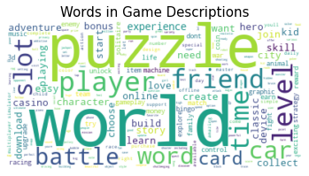

# Google Games Recommendation System

Author: TeYang, Lau  
Last Updated: 2 February 2021

 

### Please refer to this [notebook](https://www.kaggle.com/teyang/google-games-recommendation-system) on Kaggle for a more detailed analysis of the project.   ###

## **Project Motivation** 

Recommendation systems are ubiquitous in our daily lives, from online shopping to YouTube videos to match dating  to mobile apps!  When you unlock your phone the first thing in the morning, it suggests to you interesting news articles about what happened when you were asleep. On your way to work, Google Map informs you that the usual route you took had an accident and advised alternative ways. During work, your boss asks you to research a topic. You did a online search query and Google gave you suggestions to webpages that might give you more info. After a hard day's work, you decided to treat yourself to a nice meal and Google Maps recommended the best restaurants near to you. On your way home, while listening to music to relax,  Spotify proposed a new song that matches your musical taste.

Recommending products or services to people is easy, and it has been around since ancient times. However, personalized recommendations are harder as it involves the recommender knowing about your preferences and likes. In this digital age, all these are captured by companies, who then used this data to recommend their products and services to you.

Building a personalized recommendation system thus requires lots of data, which unfortunately, due to privacy, confidentiality and competitive reasons, are not shared publicly by companies. Therefore, the motivation of this project find a product or service whereby data regarding users can be obtained and where not many people have done a project (movies, books) before. Google play games provide an excellent opportunity to do so, as APIs are available for accessing the review data, and it also offers products that many people are familiar with.

  

## **Project Goals** 

1. *Build* a recommendation system for **suggesting** games to people based on their reviews/ratings of games

2. *Scrape* google game **reviews** and game **features** from google play store

3. *Preprocess/Clean* game **description** to **generate/engineer** more features about the games

4. Use **TF-IDF** to extract most important words and **Latent Dirichlet Allocation (LDA)** for topic modelling, and use them as game features 

5. *Employ* **content-based** and **collaborative filtering** techniques to recommend games to each user based on their game ratings

6. *Evaluate* recommendation models using appropriate offline testing metrics such as **prediction accuracy, usage performance, novelty, and serendipity**

7. *Deploy* the model onto a **web app**, for users to obtain game recommendations 

     

## **About this Dataset** 

There are thousand of games on the Google Play Store. Using the Node.js [`google-play-scraper`](https://github.com/facundoolano/google-play-scraper) package, 200 games' `app IDs` from each category and collection in the store were obtained. Detailed game information and game reviews were scraped using Python [`google-play-scraper`](https://github.com/JoMingyu/google-play-scraper) package. A maximum of 2000 reviews were collected from each game, and stored in JSON format. Detailed game information contains game features like the long game description, its summary, price, released year, genre, content rating, url etc. while each review contains the username, review text, and review score on a scale of 1-5. In total, there were **~7600 games** and **~8 million game reviews** before cleaning and filtering.

  

## Exploratory Data Analysis

After filtering out users with < 5 reviews, the long tail plot shows that the majority of the users only voted for a few games, which means the user ratings matrix will be very sparse. For the distribution of reviews per game, the maximum is 2k reviews, which was selected during scraping. There are some games with very few reviews as well.

  

## Game Description Text Cleaning

The game descriptions contains many unwanted words and sections such as headers, arrows, urls, stopwords etc., and these were removed. Using bag of words, we can look at some of the most common words and bigrams to get a better idea of the game descriptions. 

  

## Content-Based Filtering

### TF-IDF for Feature Engineering

Using Term Frequency - Inverse Document Frequency (TF-IDF), the most important words from the game descriptions were extracted out and used as game features. The word cloud shows the words with the highest weightings in the game descriptions. For each game, they will have features/columns corresponding to these words. If the word is important to the game description, it will receive a higher rating.

  

### LDA for Topic Modelling

An alternative to TF-IDF is Latent Dirichlet Allocation (LDA), which is a topic model used to classify texts in documents to a user pre-specified number of topics. Each topic is a collection of dominant keywords that are representative of the topic. To get an idea of the best number of topics (N), the coherence value is calculated on a range of N values. The topics are then used as game features, with each game having a weighting/value of how much the topic is present in its description.

  

### Cosine Similarity for Similar Games

Cosine similarity was used to compute games that are similar to each other by comparing every pairwise game vectors (TF-IDF and LDA game vectors separately). The 5 games with the highest similarity to the inputted game is shown below.

Recommending similar games for **Coin Master**:

Recommending similar games for **Candy Crush**:

  

### Evaluation

For evaluating the content-based model, the user reviews were split into a train, validation and test set (40,20,40, so that for users with only 5 ratings, 2 will be used to train and evaluate on 1 rating, and finally predicted and compared to 2 test ratings). 

2 methods of recommendations were implemented for each of TF-IDF and LDA game features.

1. **Non-weighted**: User profiles were created by getting the mean of the vectors of games that were rated (train set). This `user profile` was then compared to all the game vectors to find the top ***100 most similar games*** using **cosine similarity**. For each of the game rated in the validation set that received a rating of >=3 (relevant games), a **hit** is given if it is inside the 100 recommendations. **Precision@K** and **Recall@K** metrics were then computed
2. **Weighted**: User profiles were created by computing the weighted average of the games they rated based on the ratings. A game with a rating of 2 will get a smaller weighting compared to a game with a rating of 5. The following steps are the same as the non-weighted method

|              Model |  Precision |   Recall |
| -----------------: | ---------: | -------: |
|     Weighted TFIDF | **0.0034** |     0.09 |
| Non-weighted TFIDF |     0.0019 | **0.16** |
|       Weighted LDA |     0.0020 | **0.16** |
|   Non-weighted LDA |     0.0019 | **0.16** |

The final evaluation on the test set using `Non-weighted LDA` yields a ***precision*** of **0.006** and a ***recall*** of **0.12**.

## Collaborative Filtering

* Ongoing

